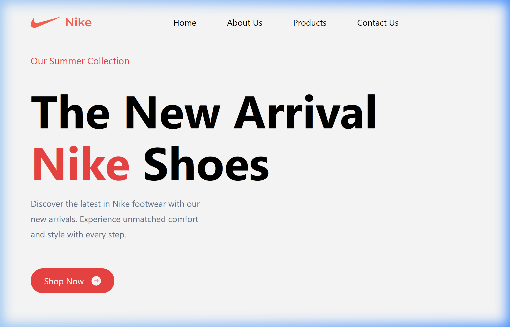
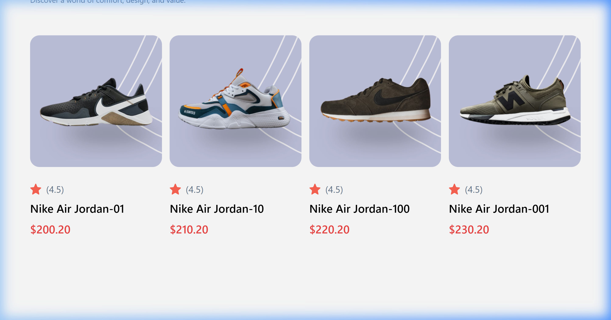
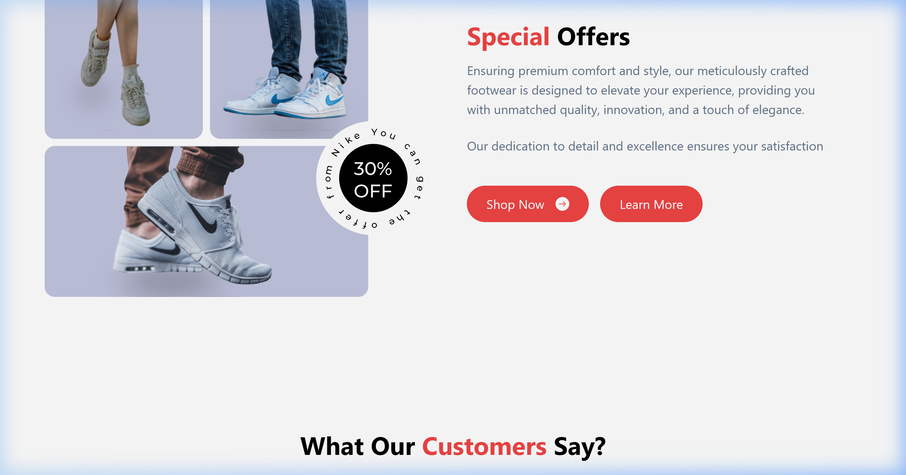
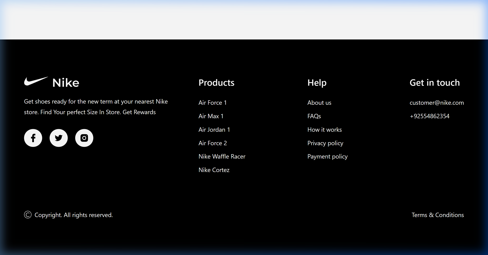

# Nike Clone - Modern E-Commerce Landing Page


A high-performance, responsive Nike landing page built with **React 19**, **Vite**, and **Tailwind CSS**. This project showcases modern web development practices, focusing on clean UI/UX, responsive design, and component-based architecture.

## 🚀 Features

- **Responsive Design**: Fully optimized for mobile, tablet, and desktop screens.
- **Dynamic Hero Section**: Interactive shoe selection with smooth transitions.
- **Product Showcase**: Beautifully designed sections for popular products and super-quality offerings.
- **Service Highlights**: Display of core services with clean icons.
- **Customer Reviews**: Testimonials section to build trust.
- **Newsletter Subscription**: Integrated call-to-action for user engagement.
- **Professional Footer**: Organized navigation and social links.

## 🛠️ Tech Stack

- **Frontend**: React 19
- **Build Tool**: Vite
- **Styling**: Tailwind CSS
- **Icons**: Custom SVG icons

## 📸 Screenshots

### Hero Section


### Popular Products


### Special Offers


### Footer


## ⚙️ Installation

1. Clone the repository:
   ```bash
   git clone https://github.com/your-username/nike-clone.git
   ```
2. Navigate to the project directory:
   ```bash
   cd nike-clone
   ```
3. Install dependencies:
   ```bash
   npm install
   ```
4. Start the development server:
   ```bash
   npm run dev
   ```

## 🤝 Contact

Hrishikesh Kali - [Your LinkedIn/Email/Portfolio]
Project Link: [https://github.com/your-username/nike-clone](https://github.com/your-username/nike-clone)
